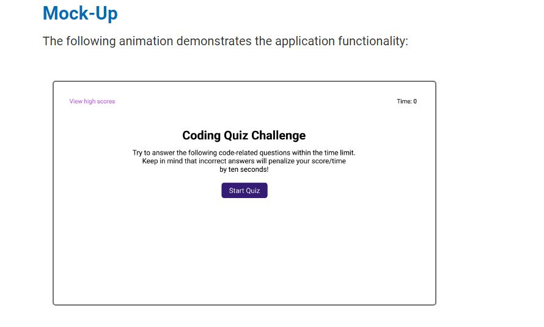
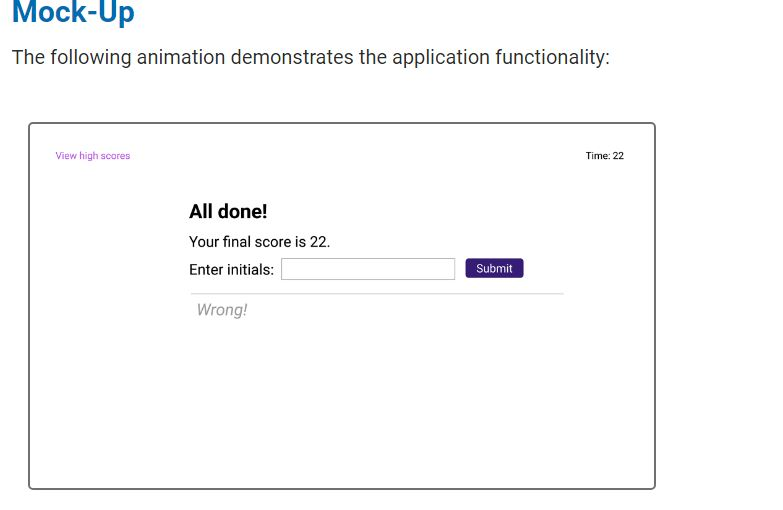

# Neils_Timed_Quiz
# Create a time Code Quiz where when a question is answered incorrectly 10 seconds 
# is removed for the time.
# the quiz initial starts with 75 sec and count down 
# if time run out it will prompt no time left
# prompt the score and the correct answer 
# prompt whether answer is correct or incorrect.
            Your Task
As you proceed in your journey to becoming a full-stack web developer, it’s likely that you’ll be asked to 
complete a coding assessment, perhaps as part of an interview process. A typical coding assessment is a 
combination of multiple-choice questions and interactive coding challenges.

To help you become familiar with these tests and give you a chance to apply the 
skills from this module, this week’s Challenge invites you to build a timed coding
 quiz with multiple-choice questions. This app will run in the browser, and will 
 feature dynamically updated HTML and CSS powered by JavaScript code that you write. 
 It will have a clean, polished, and responsive user interface. This week’s coursework will teach you all the skills you need to succeed in this assignment.
    
    
    User Story
    AS A coding boot camp student
I WANT to take a timed quiz on JavaScript fundamentals that stores high scores
SO THAT I can gauge my progress compared to my peers
        Acceptance Criteria
GIVEN I am taking a code quiz
WHEN I click the start button
THEN a timer starts and I am presented with a question
WHEN I answer a question
THEN I am presented with another question
WHEN I answer a question incorrectly
THEN time is subtracted from the clock
WHEN all questions are answered or the timer reaches 0
THEN the game is over
WHEN the game is over
THEN I can save my initials and score
Psuedo Code
# set timer 
# Count down timer
# minus 10 from timer for wrong answer
# Give options to click to choose answer
# compares answer to see it is coreect or wrong
# imediatedly prompt user when answer is wrong or right
# get initials along with scores
# tabulated results with initials from highest to lowest
# give option to reset of clear storage of high scores

## Mock up 

[How the page should look](./assets/images/quiz_layou.JPG)

## My Version
[How the page is](./assets/images/final.JPG)
[How the page is](./assets/images/final_score.JPG)

## Problems Submit Button works sometimes and scores are not displayed on Tabulate_High_Score.html

## Resources
Notes From True and False Game Plus Timer games and https://www.w3schools.com/